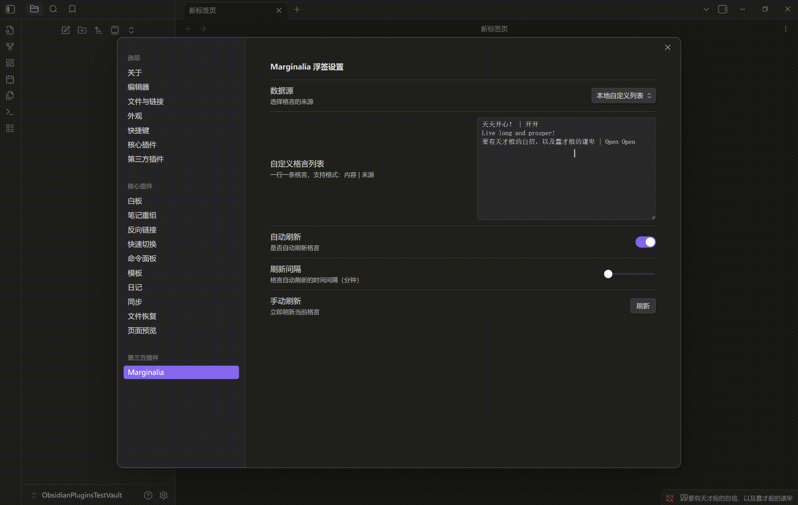
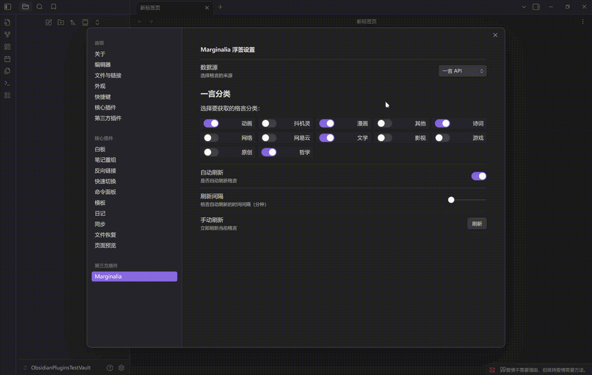
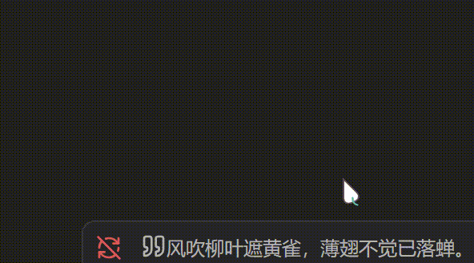

# Marginalia 浮签


> 利用屏幕边缘的微小空间，为写作者提供不期而遇的灵感。

**Marginalia (浮签)** 是一款基于 Obsidian 的沉浸式状态栏插件。它利用屏幕底部的状态栏空间，通过“一言」API 或自定义语录库，展示格言、名言或灵感片段。

## 目录

- [✨ 功能特性](#-功能特性)
- [📥 安装方法](#-安装方法)
- [🔒 隐私与网络连接](#-隐私与网络连接)
- [⚙️ 配置说明](#️-配置说明)
- [🛠️ 开发说明](#️-开发说明)
- [📜 许可证](#-许可证)
- [🤝 贡献与联系](#-贡献与联系)
- [📅 更新日志
  ](#-更新日志)

---

## ✨ 功能特性

- 📝 **多种数据源**：支持「一言」API (Hitokoto) 和本地自定义列表。
- 🔄 **自动刷新**：可配置自动刷新间隔（1-60分钟），让灵感流动。
- 🔀 **分类精选**：支持筛选动画、文学、哲学、诗词等特定类型的句子。
- 📋 **私有语录**：支持添加和管理你自己的摘抄库。
- 🖱️ **极简交互**：悬浮查看来源，点击立即刷新，右键一键复制。
- 📱 **全端支持**：完美适配桌面端和移动端 UI。

### 功能演示

* 本地自定义列表模式



* 「一言」API模式



* 右键点击即可复制



## 📥 安装方法

### 方法一：使用 BRAT 插件安装（推荐用于测试）

在官方商店审核通过前，推荐使用 [BRAT](https://github.com/TfTHacker/obsidian42-brat) 插件安装：

1. 在 Obsidian 社区插件市场搜索并安装 **BRAT**。
2. 打开 BRAT 设置，点击 `Add Beta plugin`。
3. 输入本仓库地址：`https://github.com/OpeNopEn2007/obsidian-marginalia`
4. 点击 `Add Plugin` 即可。

### 方法二：从 Obsidian 社区插件市场安装

*(注：插件目前正在官方审核流程中，上架后可直接搜索安装)*

1. 打开 Obsidian 设置 -> **社区插件**。
2. 关闭「安全模式」。
3. 点击「浏览」，搜索 `Marginalia`。
4. 点击安装并启用。

### 方法三：手动安装

1. 在 GitHub Releases 页面下载最新的 `main.js`, `manifest.json`, `styles.css`。
2. 将文件放入 `.obsidian/plugins/marginalia/` 文件夹中。
3. 重启 Obsidian 并启用插件。

## 🔒 隐私与网络连接

### 网络访问说明

- 当使用 **一言 API** 作为数据源时，插件会定期访问 `https://v1.hitokoto.cn/` 获取随机格言。
- 当使用 **本地自定义列表** 时，插件不会产生任何网络请求。

### 隐私承诺

- **不收集用户数据**：插件不会收集、存储或传输任何用户的个人信息或使用数据。
- **不跟踪用户行为**：插件不会记录用户的任何操作或偏好。
- **透明的数据使用**：所有网络请求仅用于获取公开的格言内容，不包含任何用户标识信息。

### 离线使用支持

即使在完全离线的环境中，插件也能正常工作，只需将数据源切换为「本地自定义列表」即可。

## ⚙️ 配置说明

### 1. 数据源设置

- **「一言 」API**：联网获取随机格言。
- **本地自定义列表**：仅展示本地配置的内容，离线可用。

### 2. 「一言」分类对照表

|    代码    | 分类 |    代码    | 分类 |    代码    | 分类   |
| :---------: | :--- | :---------: | :--- | :---------: | :----- |
| **a** | 动画 | **e** | 原创 | **i** | 诗词   |
| **b** | 漫画 | **f** | 网络 | **j** | 网易云 |
| **c** | 游戏 | **g** | 其他 | **k** | 哲学   |
| **d** | 文学 | **h** | 影视 | **l** | 抖机灵 |

### 3. 自定义格言格式

支持纯文本或带来源的文本，一行一条：

```text
这里是格言内容
这里是格言内容 | 这里是来源作者
```

## 🛠️ 开发说明

如果你是开发者，或者想自己修改源码，请参考以下流程。

**环境要求**

- Node.js 16+
- npm 或 yarn

**快速开始**

1. **克隆仓库并安装依赖：**

```Bash
git clone [https://github.com/OpeNopEn2007/obsidian-marginalia.git](https://github.com/OpeNopEn2007/obsidian-marginalia.git)
cd obsidian-marginalia
npm install
```

2. **配置自动部署环境 (可选)：** 本项目支持在开发时自动将构建好的插件同步到你的 Obsidian 测试库。

- 复制根目录下的 `.env.example` 文件，重命名为 `.env`。
- 修改 `.env` 文件中的 `OBSIDIAN_VAULT_PATH` 为你本地 Obsidian 插件目录的绝对路径。

```env
# .env 示例
OBSIDIAN_VAULT_PATH=D:\Vault\MyTestVault\.obsidian\plugins\marginalia
```

- *注意：`.env` 文件已被 git 忽略，你的路径隐私不会被上传。*

3. 启动开发模式：

```Bash
npm run dev
```

此时修改代码，插件会自动重新编译（并同步到你的测试库），在 Obsidian 中通过命令 `Reload app without saving` 即可看到效果。

4. 构建生产版本：

```Bash
npm run build
```

构建产物将输出至 `./marginalia` 目录。

**项目结构**

```Plaintext

Marginalia/
├── src/
│   ├── services/          # 核心业务逻辑
│   │   ├── hitokoto.ts    # API 请求处理
│   │   └── statusBar.ts   # 状态栏 UI 组件
│   ├── main.ts            # 插件入口
│   └── settings.ts        # 设置面板逻辑
├── esbuild.config.mjs     # 构建配置 (含自动部署逻辑)
├── .env.example           # 环境变量范例
└── manifest.json          # 插件清单文件
```

## 📜 许可证

MIT License. Copyright (c) 2025 Open Open.

## 🤝 贡献与联系

欢迎提交 Issue 反馈 Bug，或提交 Pull Request 贡献代码！

- **作者：**Open Open
- **GitHub：**[OpeNopEn2007](https://github.com/OpeNopEn2007)

---

## 📅 更新日志

**v1.0.0.4**

- ✨ **新特性：** 实现了全新的悬浮式气泡提示 (Tooltip)，包含平滑的淡入淡出动画。
- 🎨**UI 优化：** 将状态栏 Emoji 替换为 Obsidian 原生 Lucide 图标，视觉更统一。
- 🐛 **修复：** 修复了 Hitokoto API 请求参数格式错误。
- ⚡ **性能：** 为设置面板的输入框添加了防抖 (Debounce) 处理，避免频繁刷新。

**v1.0.0.3**

- 🔧 **工程化：** 重构构建脚本，支持自动分发文件到指定目录。
- 🌐 **网络：** 优化 URL 参数构建逻辑，符合 RESTful 规范。

**v1.0.0.2**

- ⚡ **算法优化：** 修复了随机重复逻辑，确保不会连续两次返回同一条格言。
- 🛡️ **防护机制：** 针对 API 添加额外防护，如果内容重复则自动重试。
- 🎨 **UI 净化： **移除了提示信息中的 Emoji，回归纯文字的极简风格。

**v1.0.0.1**

- 💄 **UI Refinement：**优化状态栏悬浮提示逻辑，只显示来源属性。

**v1.0.0.0**

- 🔨 **构建优化：** 修改构建脚本，实现自动化分发文件夹构建流程。
- 📝 **文档：** 更新作者信息，正式署名为 Open Open。

**v1.0.0**

- 🎉 **初始版本发布。**
- 支持一言 API 和本地自定义列表。
- 支持自动刷新（1-60分钟）和点击手动刷新。
- 支持右键复制功能。
- 支持多种一言分类选择。
